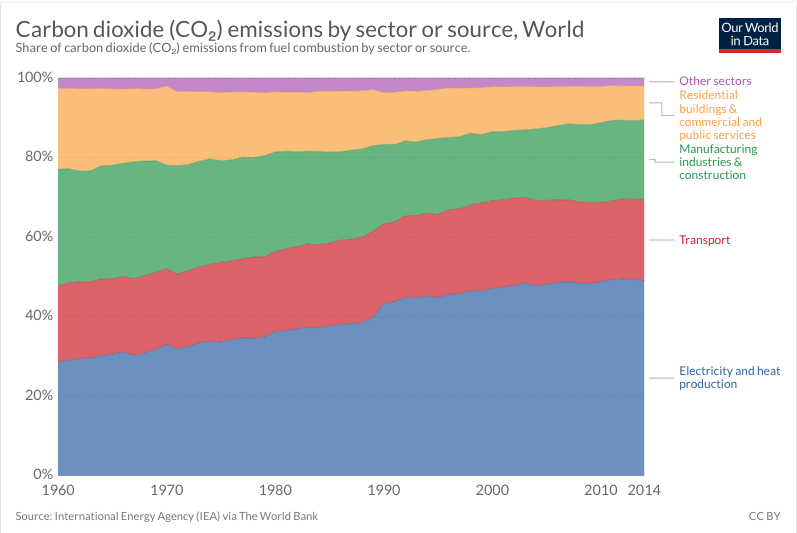

It has been reported that the levels of climate warming gasses are set to rise to near record amounts in 2019. The things that people do in their day to day lives affect the way the earth is evolving and not in a good way. These statistics show the main sources of CO2 emissions

 

If the way we treat the land we live in does not change, the world could end sooner than we think.

After seeing these figures I decided to create this installation. Its main focus is to make people aware of the contributing factors of global warming and to make them more conscious of their carbon footprint. I have edited an image of a landscape to mirror the top half of itself so that it looks like a waveform. It has been split into 6 different sections when touched each section plays a short soundscape. These soundscapes have been created using my own field recordings and royalty free sounds. I have made this an interactive piece because I am urging the audience to get back in touch with nature. I have also not seen any physical photos that make sound through the use of touch.

There are many artists that use photography and pictures on the subject of global warming. An example of this is ’s [Allison Janae Hamilton's](http://www.allisonjanaehamilton.com/biography) work which uses pictures of landscapes to tell the story of how climate change and the weakness of the earth is affecting communities that live within it. I have taken the idea of using photography in this piece more specifically the silhouette of a landscape. I have chosen to use a silhouette due to the connotations that it provides. The major one being that a silhouette is dark and almost like a shadow. This can be seen as showing that if we don’t do anything about climate change there will be nothing there just like a shadow. It also can be seen as saying that climate change has been left in the dark by the public and that there is not enough going on to fix it.

There are also many sound artists that have created pieces based on global warming and climate change. An example of one of these is Stephan Crawfords ‘The Climate Music Project’ which is a sound piece based on 500 years of data on global warming. The group consists of 2 composers and 4 scientists, their main goal is to communicate the urgency of global warming to the public and urge them to take action. The peak of the piece has been described as ‘more noise than music, like the static of a TV’. They have used this unsettling noise to convey the severity of the issue that is climate change. I have taken this idea of television static and used it at the end of my own installation. Although I am still using the climate projects use of static to shock the audience. I have put the sound into context as the last soundscape is someone flicking through channels which I am using to show what people are doing about the global warming crisis.
 

